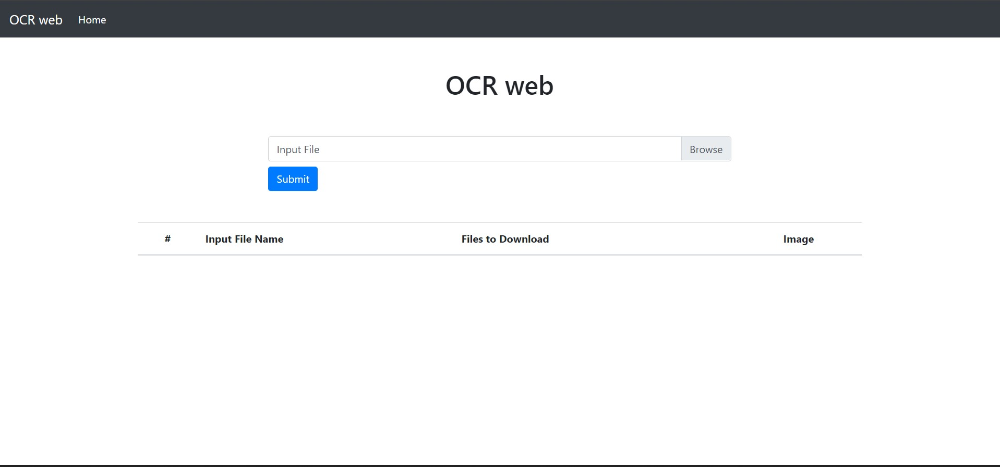
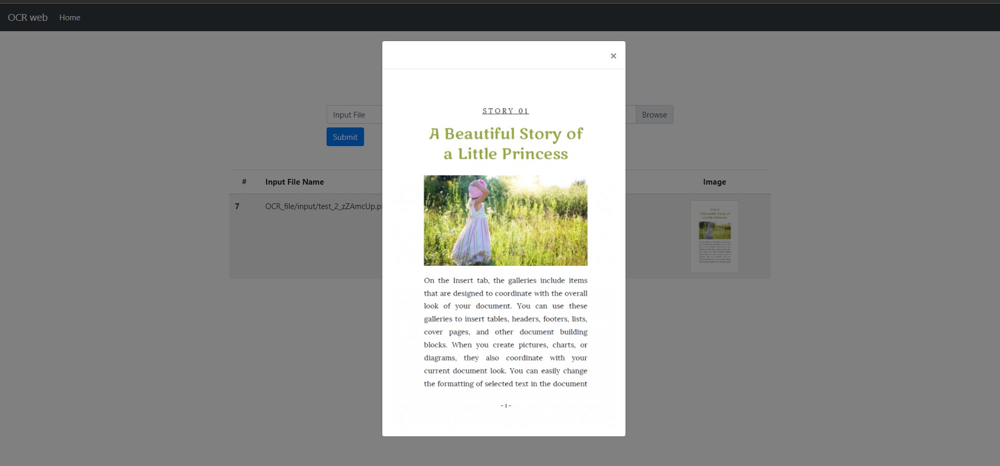

[](https://circleci.com/gh/fabinhojorge/OCR_web)

# OCR web (Software Engineering Course Project)
This project is an OCR (Optical Character Recognition) web interface for images/PDFs. 
The idea of this project is to study technologies like Python, Django, Tesseract(OCR), Continuous Integration, etc...


## How to install and Run
Firstly setup a Virtual Environment by following the below steps:
1. Open Terminal with Run as Administrator, and enter command ``` Set-ExecutionPolicy RemoteSigned ```.
2. Then install virtualenv, by using command ``` pip install virtualenv ```.
3. Go to the folder, where you want to create the folder for your website. (Let it be named as 'VirtualEnv' (You can choose any name!)).
4. Open Terminal in that folder and run command ``` virtualenv <folder_name> ``` (Let <folder_name> be 'venv_folder').
5. Go inside the new folder created (venv_folder) by running command ``` cd <folder_name> ```.
6. Then run command ``` ./Scripts/activate ```. This will allow you to enter a functional virtual environment.
7. Then download the zip file of the code, and extract the zip inside this folder (<folder_name>, here 'venv_folder').


Then run the below commands:

```
pip install -r requirements.txt

python manage.py migrate

python manage.py runserver
```

So you can access in the local URL: _[localhost:8000](localhost:8000/)_


Inside the _requirements.txt_ there is a package called __pytesseract__. 
It´s the wrapper to communicate with the Tesseract library (C/C++ code). 
So, the next step is to install the Tesseract itself. 

For this, please follow the below instructions for your SO:
* [Windows](https://github.com/UB-Mannheim/tesseract/wiki)
* [Mac and Linux](https://github.com/tesseract-ocr/tesseract/wiki)

If an additional language is required, it is necessary to download it from [here](https://github.com/tesseract-ocr/tessdata) and move it to $TESSERACT_PATH/tessdata/

## How to use
1. After you run the above mentioned commands (till python manage.py runserver), go to the local host.
2. There will be a file upload section in the centre of the screen. You can upload the file by clicking on the 'Browse' button, or by clicking anywhere on the input-file bar.
3. Once you click as mentioned, it will open a dialog box to select the file to be uploaded, from your local machine.
4. Select the file (acceptable file extensions are: .jpeg,.jpg,.png,.pdf; if uploaded file is of other extension, then it will show an alert), and click on'Submit'.
5. You will be presented with 2 links (one for .docx output file, and other for .pdf output file) to download the output file.
6. The website is ready to use again, just after an output is given to user in form of those links.


## Libraries Used
* Django
* Pillow
* Bootstrap
* JQuery
* Tesseract (pytesseract)


## Screen Shots

__Home Page__


__Image Zoom__

